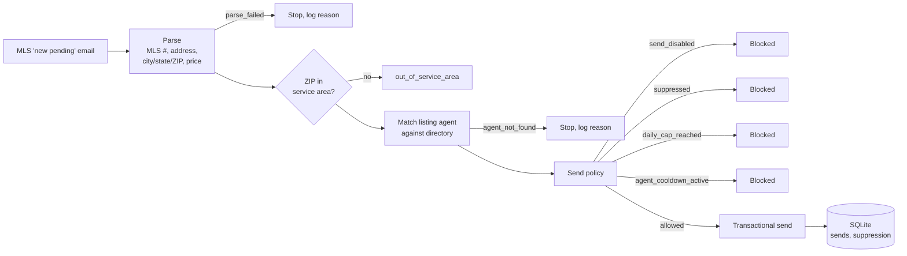
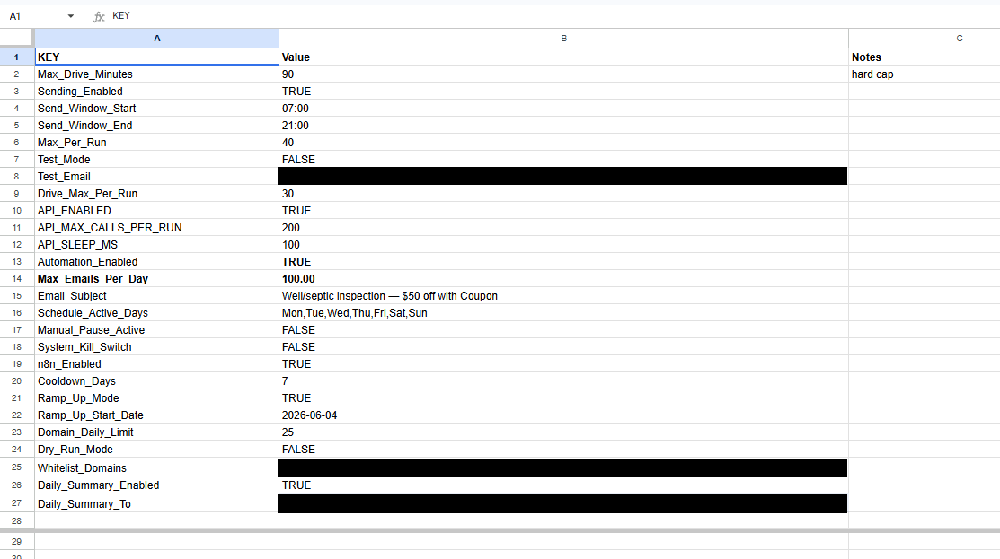
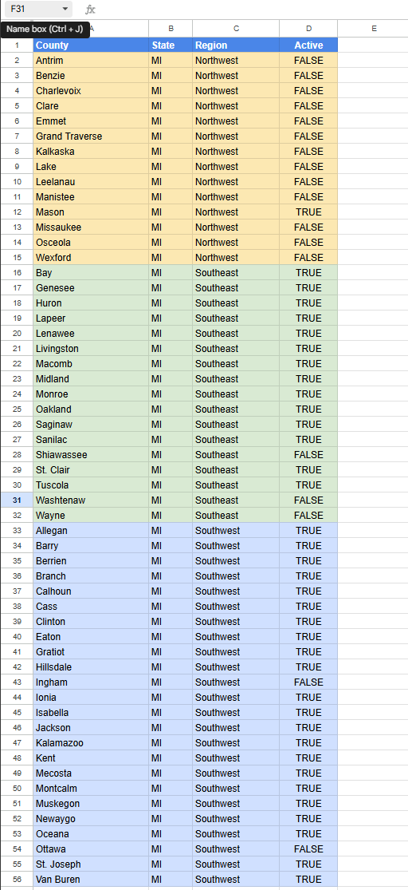
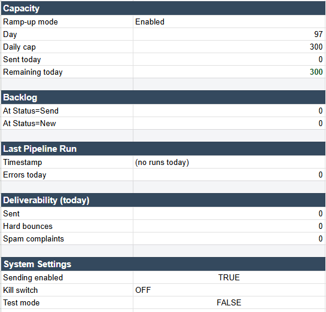
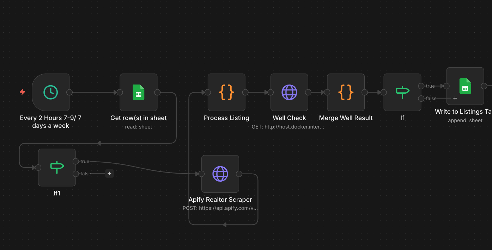
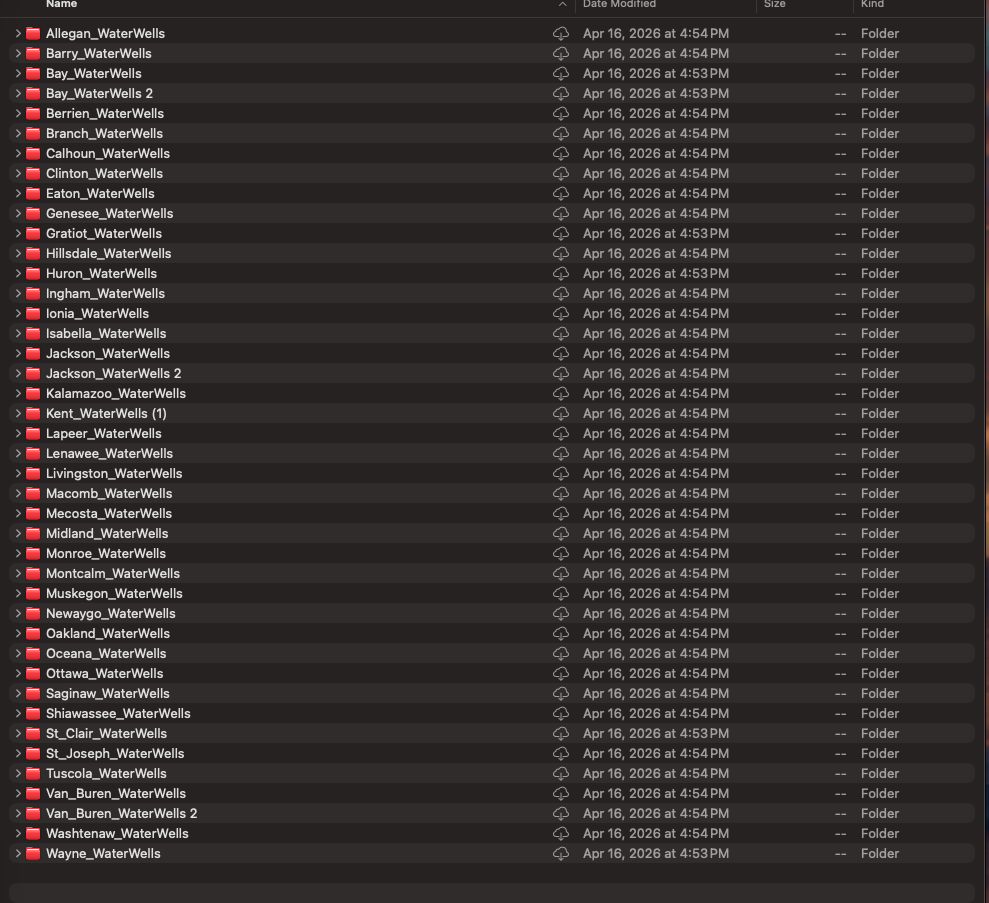
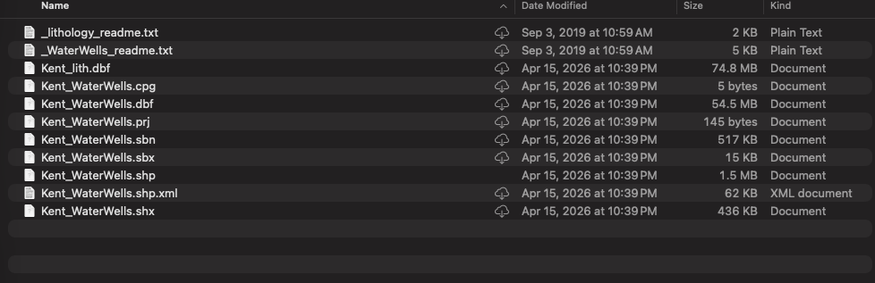
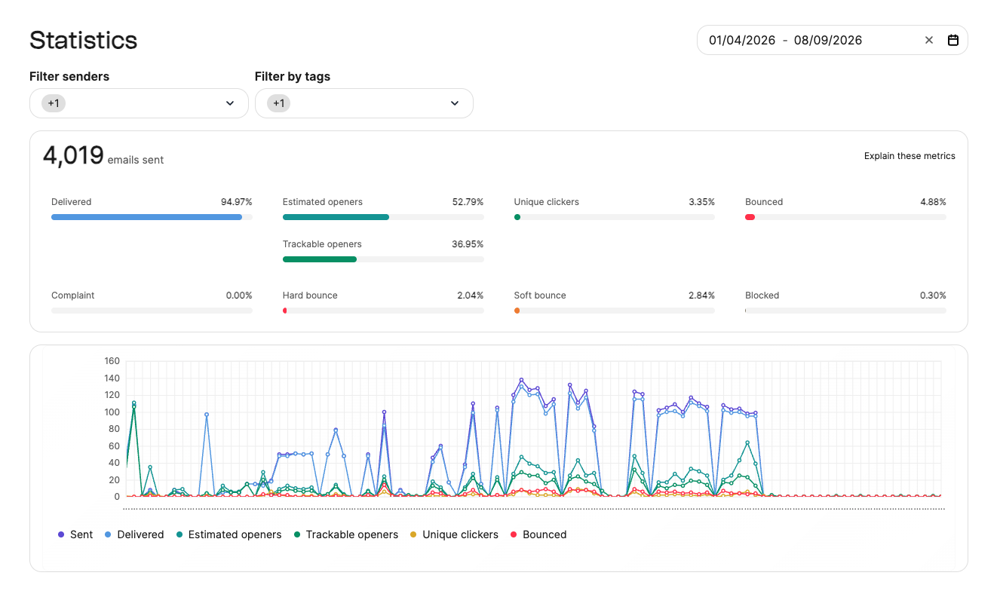

# Compliance-guarded outreach automation — case study

**A listing-triggered email automation for a home-inspection company: the v1 built with every guardrail first and deliberately held back, and the production rebuild that has run since January 2026.**
Ryan Faber / Red Three Pro. Built for a Michigan home-inspection company. Private.

> Documentation only. Source and data are private; no agent, customer, or listing data appears here. Numbers for the production system come from the email provider's statistics page and the system's own configuration and dashboard sheets, captured September 2026. Numbers for v1 come from its repository and database.

**Status:** in production. 4,019 emails sent between January 4 and August 9, 2026 at 94.97% delivery and 0.00% spam complaints, with a spreadsheet control plane the office can operate and a kill switch that has been exercised.

---

## The problem

When a home goes under contract, the buyer needs an inspection within days, and the listing agent often influences who gets called. The company already received MLS "new pending" notifications. Put a well-and-septic coupon in front of the right agent at exactly that moment, automatically, without ever becoming the company that spams agents. The referral relationships are worth more than any campaign.

The twenty-line version of this sends email. The version that could be trusted to run unattended needed brakes before it needed an engine.

## Part 1: v1, built with the brakes first (December 2025)

A small Node service, seven source files, one job.

**Send policy, four checks in order, each logged with a reason when it blocks:** a kill switch that must literally equal `true` (off is the default); a suppression list with admin endpoints; a daily cap across all recipients (25 by default); a per-agent cooldown (21 days by default). Every non-send returns a structured reason, so a batch of notifications reads as a table of outcomes. A demo mode redirects every send to an internal address so the pipeline can run against real notifications with nobody receiving anything.

**Why v1 was held back.** The final integration needed the service to read a mailbox, and which mailbox, whose credentials, and what else that exposed were the company's decisions, not mine. And the guardrails covered volume, frequency, and opt-out but not consent, sender identification, or disclosure language. So v1 stopped one integration short: one recorded send, a test on 2025-12-15, kill switch off since. Adding a suppression list after the first angry reply means the first angry reply already happened.

## Part 2: the production rebuild (January 2026 to present)

Once the mailbox and compliance questions had answers, the system was rebuilt on self-hosted n8n with the v1 guardrails as the baseline rather than a rewrite. Three design choices define it.

### A spreadsheet is the control plane

Every operating parameter lives in a configuration sheet the office can read and edit without touching a workflow. The workflow reads it on every run.

What the sheet controls, as captured in September 2026:

| Control | Setting |
|---|---|
| Sending enabled, automation enabled, n8n enabled | three independent switches, all must be on |
| System kill switch, manual pause | two ways to stop, one for emergencies and one for "not today" |
| Test mode, dry-run mode | run the whole pipeline and send nothing, or send only to an internal address |
| Send window | 07:00 to 21:00, active days configurable |
| Max per run, max per day | 40 per run, 100 per day |
| Per-domain daily limit | 25, so no single brokerage domain gets flooded |
| Cooldown | 7 days per agent |
| Drive-time qualification | 90-minute hard cap, drive-time lookups capped per run |
| External API budget | calls per run capped, with a sleep between calls |
| Ramp-up mode | start date and a rising daily cap, so volume grows gradually rather than arriving all at once |
| Whitelist domains, daily summary | recipients for the daily digest; send-to-self domain for testing |

### Service area is data, not code

A county table with region and an active flag decides eligibility. Turning a county on or off is a cell edit.

### The operator sees the system's state at a glance

A dashboard sheet refreshes after each run: capacity (ramp-up day, daily cap, sent today, remaining), backlog by status, last run and errors, today's deliverability (sent, hard bounces, spam complaints), and the three system settings that matter. When the kill switch is on, the header says so in red.

### The workflows

**Listing ingest.** Runs every two hours between 7 AM and 9 PM, seven days a week. It reads the configuration sheet first and stops if automation is off. Otherwise it calls a hosted scraper for new listings, normalizes each one, checks it against a locally hosted well-records lookup (the well/septic qualification), merges the result, filters, and appends qualified listings to the Listings tab that the send workflow consumes.

Two things this canvas shows without any data on it: the enable check is the second node, before anything external is called, and the well lookup is a local service, so the qualification that matters most doesn't depend on a third party.

### The well-records lookup: a statewide public dataset made queryable

The company's coupon is for well-and-septic evaluations, so the single most valuable qualification is "does this property have a well." Michigan publishes water-well records as per-county GIS exports. Those exports, 39 counties covering the service area with a lithology table alongside each, were loaded onto the same machine as a locally hosted lookup service that the ingest workflow queries per listing. No per-listing API cost, no rate limit, no third party in the path.

A single county's well table runs to tens of megabytes; the largest in the service area is over 50 MB with a 75 MB lithology table. Michigan has no statewide septic registry, so the septic side of the qualification comes from the well side and the listing data rather than a records lookup.

**Send and guardrails.** As described by the operator; the canvas will be added after a read-only export review: for each listing at status Send, compute inspector drive time and drop anything past the cap; check do-not-contact, cooldown, per-domain and daily caps, and the send window; route and send the transactional email; record state with duplicate protection; log every skip with a reason. A daily summary goes to the office.

## Results

Provider statistics for January 4 through August 9, 2026:

| Metric | Value |
|---|---|
| Emails sent | **4,019** |
| Delivered | **94.97%** |
| Estimated openers | 52.79% (trackable 36.95%) |
| Unique clickers | 3.35% |
| Hard bounce | 2.04% |
| Soft bounce | 2.84% |
| Blocked | 0.30% |
| **Spam complaints** | **0.00%** |

The daily chart shows the shape the guardrails produce: sends arrive in capped daily plateaus (the 40-per-run and 100-per-day limits, later raised under ramp-up), with gaps where the send window, the weekend schedule, or a pause held them back. A zero complaint rate across four thousand cold emails to real estate agents is the number the whole design was built to protect.

Booked inspections attributable to the campaign are tracked in the company's scheduling system and are not published here.

## Decisions worth explaining

**Guardrails before the first send, in both versions.** v1's four checks became the production system's floor. The production system added the ones v1 lacked: per-domain limits, a send window, ramp-up, and a dry-run mode. Nothing was removed.

**Configuration in a spreadsheet.** The office manager will never open n8n. A sheet with a KEY and a Value column is the interface everyone already knows, and it means a pause, a cap change, or a kill can happen from a phone.

**Fail closed, three switches deep.** Sending, automation, and the workflow engine each have their own enable flag, plus a kill switch and a manual pause above them. Any one of five things off means nothing sends.

**Ramp-up instead of launch.** Volume started small on a fixed date and rose on a schedule. Deliverability reputation is built, not declared, and a sudden spike from a fresh sender is how legitimate mail gets classified as spam.

**Reasons, not booleans.** Every skip is logged with why. The daily summary is readable because of it.

## What's not done

- The send workflow's canvas and per-node logic are not yet documented here; they will be after a read-only export review. The ingest workflow is shown above.
- v1's caps skip the check when unset rather than failing closed. The production system's three-switch design supersedes it.
- Consent and disclosure handling is present in the production system but not documented here until the export review.

## By the numbers

| | |
|---|---|
| v1 | 7 source files, 4 policy checks, 8 structured outcomes, 1 test send (2025-12-15), never launched |
| Production | in operation January 2026 to present, self-hosted n8n |
| Sent | 4,019 (Jan 4 to Aug 9, 2026) |
| Delivered / hard bounce / complaints | 94.97% / 2.04% / 0.00% |
| Guardrails | 5 stop controls, 4 volume caps, send window, 7-day cooldown, 90-minute drive cap, ramp-up |
| Control plane | 3 spreadsheets: configuration, county coverage, dashboard |
| Ingest cadence | every 2 hours, 7 AM to 9 PM, 7 days |
| Well-records dataset | 39 counties of state GIS exports, hosted locally as a lookup service |

## How it was built

I defined the workflow, the qualification rules, the guardrails and their order, the spreadsheet-as-control-plane design, and the decision to hold v1 until the compliance posture was right. AI coding agents wrote the v1 service and helped assemble and iterate the n8n workflows under that direction. I verified v1 end to end in demo mode before deciding not to launch it, and I operate the production system, watching the daily summary and the deliverability numbers.

---

Part of the [Red Three Pro portfolio](https://github.com/Redthreepro). See also: [Field-inspection AI platform](https://github.com/Redthreepro/inspection-ai-platform-case-study). Questions: redthreepro@gmail.com
