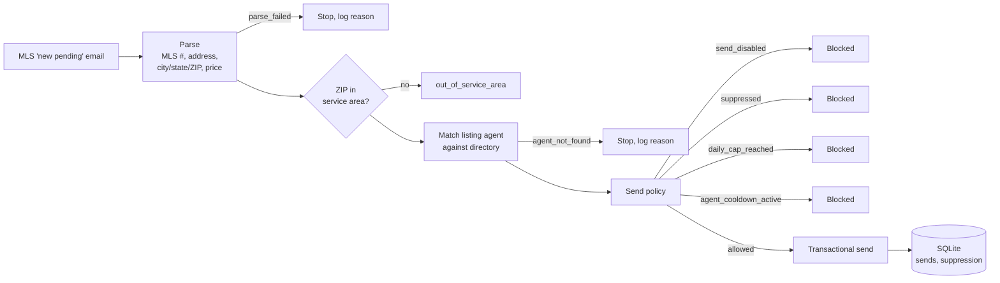

# Compliance-guarded outreach automation — case study

**The v1 of a listing-triggered outreach automation: every guardrail built before the first real send, then deliberately held back. Its production successor runs on n8n.**
Ryan Faber / Red Three Pro, December 2025 onward. Built for a Michigan home-inspection company. Private.

> Documentation only. The source is private and the agent directory it reads is confidential. Verified against the repository and its database in September 2026. No agent, customer, or listing data appears here.

**Status:** this case study covers the **v1 Node pipeline**, which was completed, test-verified end to end, and never launched: one recorded send, a test on 2025-12-15, kill switch off since. It was superseded by a **production rebuild on self-hosted n8n** that carries the same guardrails and has sent over 1,000 automated emails as of September 2026. The production system runs on separate infrastructure and is described here from the operator's account; a full write-up will follow once it has been audited the way the other case studies were. This document is about the design of the restraint, which is the part that carried over.

---

## The problem

When a home goes under contract, the buyer needs an inspection within days. The listing agent often influences who gets called. A home-inspection company that also does well and septic evaluations wanted to put a coupon in front of the listing agent at exactly that moment, automatically, from the MLS "new pending" notifications it already received by email.

The obvious build is twenty lines: parse the email, look up the agent, send. The obvious build is also how a company ends up on a blocklist, annoys the agents it depends on for referrals, and violates commercial email rules it has never read. The brief was to build the automation and to make it impossible for the automation to do damage.

## What got built

A small Node service with one real endpoint and one job.

**Parse.** A regex parser pulls the MLS number, street address, city, state, ZIP, and price out of the raw notification. If it can't get an MLS number and a ZIP, it stops and says why.

**Filter.** The ZIP is checked against the company's service area. Out of area, stop.

**Match.** The listing agent's name is normalized and looked up in the company's agent directory, an export from its scheduling system with flexible column handling because the export format was not under the company's control. No match, stop.

**Send policy.** Four checks, in order, each one logged with a reason when it blocks:

1. **Kill switch.** An environment flag that must literally equal `true`. Absent or anything else, nothing sends. This is the default state.
2. **Suppression list.** Any address on it is never emailed. Admin endpoints add, remove, and list suppressions.
3. **Daily cap.** A maximum number of sends per day across all agents. The shipped default is 25.
4. **Per-agent cooldown.** An agent who received an email within the last N days is skipped. The shipped default is 21 days.

**Send and record.** A transactional email through Brevo, then a row in a local SQLite table with recipient, agent, listing, and timestamp, indexed for the cap and cooldown queries.

Every non-send returns a structured reason (`parse_failed`, `out_of_service_area`, `agent_not_found`, `send_disabled`, `suppressed`, `daily_cap_reached`, `agent_cooldown_active`, `send_failed`), so the operator can see exactly why a listing produced no email without reading logs.

A demo mode redirects every send to a fixed internal recipient so the whole pipeline can be exercised against real notifications without any agent receiving anything.

## Why it was never launched

Two reasons, both deliberate.

**The trigger wasn't right.** The design assumed notifications arriving in a mailbox the service could read. Wiring that final integration meant either a mail-forwarding rule or an inbound-mail hook, and both raised questions about which mailbox, whose credentials, and what else would be exposed. That decision belonged to the company, and it was never made.

**The compliance posture wasn't finished.** The guardrails cover volume, frequency, and opt-out. They do not cover consent, sender identification, or the disclosure language commercial email rules require in the message body. Sending to a directory of agents who never opted in is the kind of thing that works until it very much doesn't. The right move was to stop one integration short and leave the kill switch off.

The service still runs. The one recorded send is a test. The live configuration omits the kill-switch flag entirely, which means the policy blocks everything by construction.

## Decisions worth explaining

**Fail closed, in the config and in the code.** A missing flag means off, not on. A missing cap value means the cap check is skipped, so the defaults are documented in the example config and the live config is expected to set them. A future improvement, noted honestly: make missing caps fail closed too.

**Reasons, not booleans.** Every stage returns a reason string. This cost nothing to build and made the demo-mode dry runs readable: a batch of notifications becomes a table of outcomes rather than a count of sends.

**Guardrails before the first send, not after the first complaint.** The suppression list, cap, and cooldown were built before any agent was contacted. The order matters. Adding a suppression list after the first angry reply means the first angry reply already happened.

**Keep it small.** Seven source files, one database, no framework beyond Express. There is nothing here that couldn't be read in full in twenty minutes, which is the right size for something that sends email on a company's behalf.

## What happened next: the production rebuild

The v1 answered the question of what has to be true before an automated email is allowed to send. The production version, rebuilt on self-hosted n8n, answered the remaining two: the mailbox integration and the compliance posture. As reported by the operator (not yet independently audited):

- Property-listing ingest with service-area and well/septic qualification rules
- Do-not-contact and per-agent cooldown controls, carried over from v1
- Inspector drive-time qualification and lead routing
- Persistent state with duplicate protection and failure logging
- Over 1,000 automated emails sent in production

The v1's four checks became the production system's baseline rather than being rebuilt from scratch, which is the practical argument for building guardrails before the first send: they survive the rewrite.

## What's not done (v1)

- The inbound-mail integration, by choice (solved in the n8n rebuild).
- Consent and disclosure handling for commercial email (addressed in the rebuild; specifics pending audit).
- Caps that fail closed when unset.
- Version control. The project was built in a single push and never committed; it has since been protected with an ignore file but has no history.

## By the numbers

| | |
|---|---|
| Source files | 7 |
| Send-policy checks | 4, each logged with a reason |
| Structured outcomes | 8 |
| Shipped defaults | 25 sends/day, 21-day per-agent cooldown |
| Sends recorded by v1 | 1 (test, 2025-12-15) |
| Sends by the n8n production rebuild | 1,000+ (operator-reported, September 2026) |
| Agent directory | five-figure record count, confidential |

## How it was built

I defined the workflow, the service-area rule, and the four guardrails, and decided the launch conditions and that they had not been met. An AI coding agent wrote the parser, the directory loader, the policy module, the database layer, and the endpoints under that direction, and I verified the pipeline end to end in demo mode against real notifications before deciding not to flip the switch.

---

Part of the [Red Three Pro portfolio](https://github.com/Redthreepro). See also: [Field-inspection AI platform](https://github.com/Redthreepro/inspection-ai-platform-case-study). Questions: redthreepro@gmail.com
